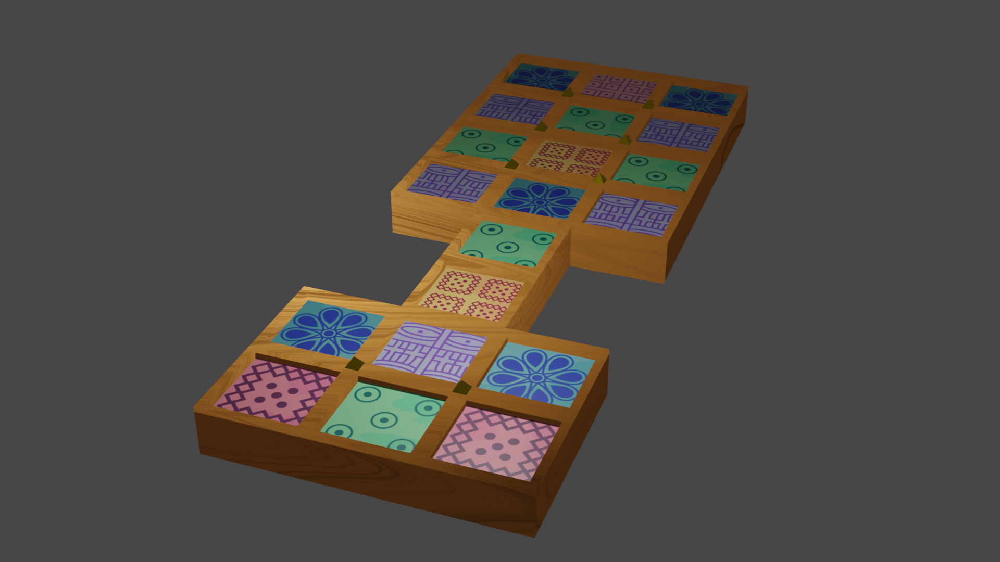

*::: [🗑️💧](https://garbo.succus.games) PROUDLY PRESENTS :::*

# The Royal Game of Ur

A game for [Probability](https://probability.nz), 2600 years in the making!

RELEASED UNDER [CC BY-SA 4.0](https://creativecommons.org/licenses/by-sa/4.0/deed.en)

* [NEFTALY HERNANDEZ](https://neftaly.com): ART, DEV
* [JOE RICKWOOD](https://joerickwood.github.io/): DEV
* [MISHA TSYATSKO](https://misha_tsyatsko.artstation.com/): ART

## How to play

[Tom Scott vs Irving Finkel: The Royal Game of Ur](https://youtu.be/WZskjLq040I)

## Editing and building

The current Play setup is in `release.json`. Models use metre dimensions and every piece has an explicit `size`; resting heights and stacks are resolved by Play.

Run `npm run build` to package the current working tree into `dist/mod.zip`. This includes uncommitted edits. Load that ZIP with Play → Edit → Create → Load, or open this folder through a template URL.
